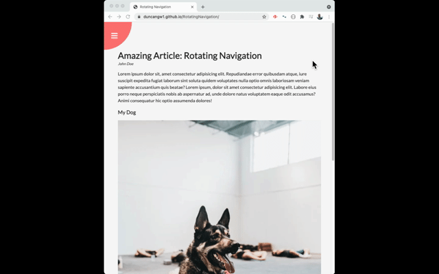

# Rotating Navigation

# 

## Description

The purpose of the Rotating Navigation project is to practice constructing a navigation menu that rotates the screen and reveals the selection menu in a creative way. This has been completed following Udemy's "50 Projects in 50 Days" course. Please view the deployed application [here](https://duncangw1.github.io/RotatingNavigation/) or navigate to the [Installation](#installation) section below for instructions on how to run the application locally.

:heavy_check_mark: Project 3 out of 50 complete!

## Table of Contents

- [Installation](#installation)
- [Technologies](#technologies)
- [Usage](#usage)
- [License](#licenses)
- [Contributing](#contributing)
- [Tests](#tests)
- [Questions](#questions)

## Installation

_How to install & get the application running._

- Clone the Git SSH Key onto the local machine
- Navigate to the local file in **VS Code** or your preffered code editor
- Open **index.html** in your local browser

## Technologies

_List of tech used to make this project._

- HTML 5
- CSS 3 (including numerous transitions and transforms)
- JavaScript

## Usage

_Guidelines for usage & application demo._

There are no usage guidelines for this application. Please see the gif below for a brief overview of the app.

## Licenses

MIT License

Copyright (c) 2020 duncangw1

## Contributing

_Interested in contributing? See the info below._

Contributions are always welcome. If interested, please send an email describing your contribution before submitting a pull request. Pull requests that are opened with a corresponding email will be reviewed as soon as time permits.

## Tests

_No tests are included with this application._

## Questions

_Reach out!_

The best time to reach me is from 8:00am-5:00pm EST, Monday-Friday. All questions will be answered in a timely manner. Emails are preferred.

- Github: [duncangw1](https://github.com/duncangw1)
- Email: duncangw1@gmail.com
